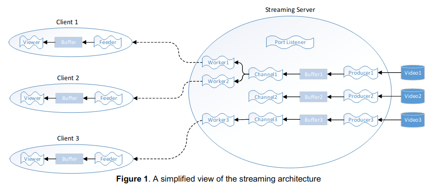

## ASCII-Art Streaming Platform


[Text based](http://www.asciimation.co.nz/) video streaming platform. This project consist of **multi-client/multi-channelled server** and **UI based client** applications. 





---

#### Server Compilation

```bash
cd src/server
make
```

#### Server Execution

```bash
cd src/server
./sserver 3000 3 ./sw1.txt sw1.txt sw1.txt
# ./server port channel_num video_file1 video_file2 video_file2
```

-------

#### Client Compilation

```bash
cd src/client
javac -Xlint:deprecation Main.java
```

#### Client Execution

```bash
cd src/client
java Main 127.0.0.1 3000 0
# address, port, channel_id   
```

